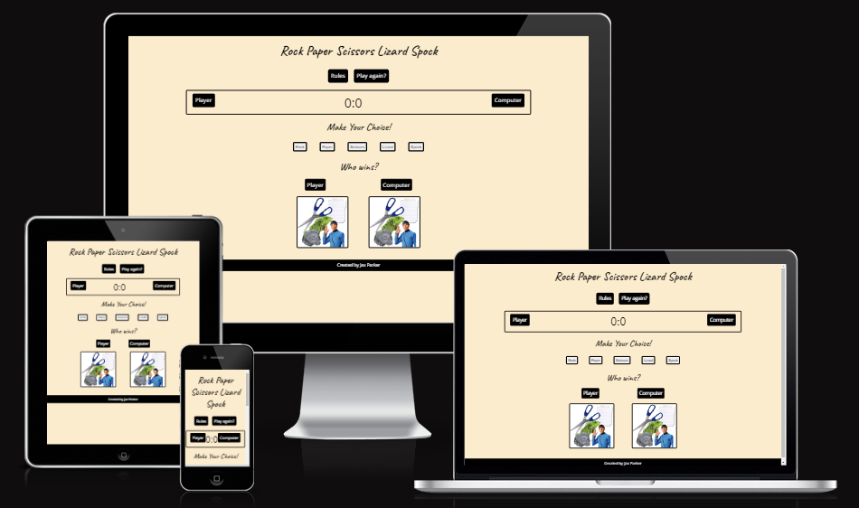
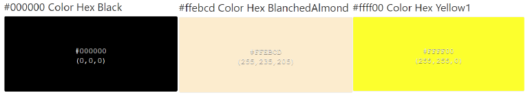
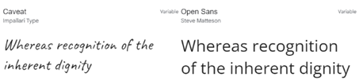
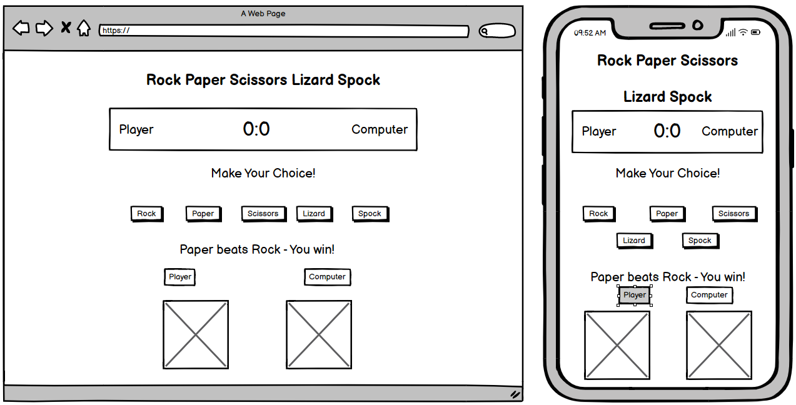
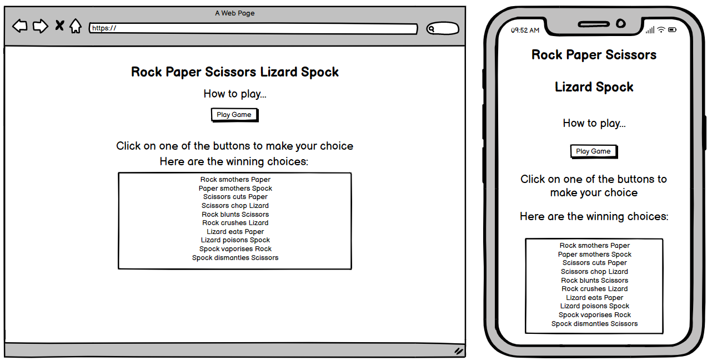
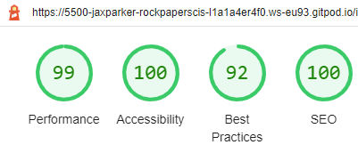

# Project 2 Rock Paper Scissors Lizard Spock Game!
  ## Purpose
  This website was created for the sole purpose of completing the second project for the Code Institues's Full Stack Developer Course. It was built using the knowledge gained from the HTML, CSS and JavaScript courses and  Scrimba course. A full list of technologies used can be found in the technologies section of this document. The game is an extension of the original Rock Paper Scissors game and has simple rules. The player picks a variable and the image is revealed simultaneously along with a random computer choice. The winner is shown in a message as per the rules page and is the first to get to 10. In the event of a tie the score remains the same until a winner is found.

  The live website can be found [here] (https://jax-parker.github.io/rock-paper-scissors-lizard-spock/).
 

***

## Table of Contents
* [Purpose](#Purpose)
* [User Experience Design (UX)](#User-Experience-Design)
  * [User stories](#User-Stories)
    * [First Time Visitor Goals](#First-Time-Visitor-Goals)
    * [Returning Visitor Goals](#Returning-Visitor-Goals)
    * [Frequent User Goals](#Frequent-Visitor-Goals)
  * [Structure](#Structure)
  * [Design](#Design)
    * [Colour Scheme](#Colour-Scheme)
    * [Typography](#Typography)
    * [Imagery](#Imagery)
    * [Wireframes](#Wireframes)
    * [Differences to Design](#Differences-to-Design)
    * [Limitations](#Limitations)
    * [Features](#Features)
    * [Existing Features](#Existing-Features)
    * [Future Features](#Features-Left-to-Implement)
* [Technologies](#Technologies)
* [Testing](#Testing)
    * [Test Strategy](#Test-Strategy)
      * [Summary](#Summary)
      * [Validation](#Validation-Test-Cases)
    * [Test Results](#Test-Results)
    * [Testing Issues](#Issues-and-Resolutions-to-issues-found-during-testing)
* [Deployment](#Deployment)
    * [Project Creation](#Project-Creation)
    * [GitHub Pages](#Using-Github-Pages)
* [Credits](#Credits)
  * [Content](#Content)
  * [Media](#Media)
  * [Acknowledgements](#Acknowledgements)
## User Experience Design

### User stories
#### Visitor Goals

    * As a visiting user, I want to be able to understand how to play the game after reading the rules.
    * As a visiting user, I want to be able visually see which choice I made.
    * As a visiting user, I want to be able to see who won the point and see the scores.
    * As a visiting user, I want to be able to see who won the game.
    * As a visiting user, I want to be able to be able to replay after the game has finished.
    
### Design
#### Colour Scheme
The colours chosen were contrasting to assist accesibility and picked from:. 

#### Typography
The title and message font used are **Caveat** which is cursive to give a fun, informal look. All other text used is **Open Sans** with letter spacing to ensure it is easy to read for children. Both fonts were imported from Google Fonts. 

#### Imagery
The favicon used was a simple rock, paper, scissors icon. The starting image was made up from the other free images from HiClipart and can be found [here](https://www.hiclipart.com/free-transparent-background-png-clipart-havpw).

#### Wireframes
Created using Balsamiq. 
Game Page 
 
Rules Page 

# Differences to design
After comparing the original wireframe designs to the finished website;
* I have added a play again button to reset the scores and start the game again. 
  
### Existing Features
- The website has two pages, on the first page the player can see the entire game and click on a button to take them to the second page displaying the rules and how to play the game. There is a score area to show the current score, choice buttons for the player to make their choice which change colour when hovered over and a message area showing the player who wone the point. After the player or computer reaches a score of ten, a message is displayed to let the player know who has one. The player can then click the 'play again' button to reset the game and start again.

### Features Left to Implement
- Display bespoke messages for each message option.

***
## Technologies

* HTML
  * This project uses HTML for the structure of the site.
* CSS
  * Is used to style the site, giving it colour and design.
* JavaScript
  * Is used for the functionality of the site allowing the player to enter their name, click through the questions, see their score and play again or return to the start.
* MS Publisher
  * Used to create the wireframes as the free Balsamic license had expired.
* [Google Fonts](https://fonts.google.com/)
	* Google fonts are used throughout the project to import the *Caveat* and *Open Sans* fonts.
* [GitHub](https://github.com/)
	* GithHub is the hosting site used to store the source code for the Website and [Git Pages](https://pages.github.com/) is used for the deployment of the live site.
* [Git](https://git-scm.com/)
	* Git is used as version control software to commit and push code to the GitHub repository where the source code is stored.
* [Google Chrome Developer Tools](https://developers.google.com/web/tools/chrome-devtools)
	* Google chromes built in developer tools are used to inspect page elements and help debug issues with the site layout and test different CSS styles.
* [balsamiq Wireframes](https://balsamiq.com/wireframes/)
	* This was used to create wireframes for 'The Skeleton Plane' stage of UX design.
* [Favicon](https://favicon.io/)
    * Favicon.io was used to make the site favicon
* [UI.Dev](https://ui.dev/amiresponsive)
    * Multi Device Website Mockup Generator was used to create the Mock up image in this README
***
# Testing

## Summary
The live project can be found [Here](https://jax-parker.github.io/rock-paper-scissors-lizard-spock/) 
This project is front end only with no back-end functionality, the testing performed will be on the visual effects, layout and the correct operation of the game. Testing to be done on at least three browsers and all screen sizes.

No elements should overlap another container div.

All buttons should work with the appropriate function.

## Accessibility Testing

Accessibility has been taken into account throughout the design of this website to make it user friendly. This has been achieved by: 
  * Using semantic HTML and adding aria-labels where possible.
  * Choosing contrasting colours to give clarity to navigation and readability. 
  * Google Lighthouse to test for accessibilty. 
   
  * To validate web accessibility the website was tested on [Wave](https://wave.webaim.org/). 
  

 ## Validation & Function Testing
 Testing Document can be found [Here](testing.md)

## Deployment

### Project Creation
The project was started by opening my Github profile page, clicking on repositories and new. I chose the Code-Institute-Org/gitpod-full-template from my template drop down box and named my repository rock-paper-scissors-lizard-spock. I checked the Public radio button and create repository. I clicked on the new repository, then clicked gitpod to open in a new workspace.

The following commands were used throughout the project:

* git add - Was used to add changes to the local repository.
* git commit -m *commit message explaining the updates* - This command was used to commit changes to the local repository.
* git push - This command is used to push all commited changes to the GitHub repository.

### Using Github Pages
1. Navigate to the GitHub [Repository:](https://jax-parker.github.io/rock-paper-scissors-lizard-spock/)
2. Click the 'Settings' Tab.
3. Click on 'Pages.
4. Select 'Main' as the branch.
5. Click the Save button.
6. Click on the link to go to the live deployed page. [Live Page:](https://jax-parker.github.io/rock-paper-scissors-lizard-spock/)
### Using A Github Branch
I wanted a space to try out code without interferring with the code I'd already written and my Mentor gave me a [link](https://www.atlassian.com/git/tutorials/using-branches) to learn about Git branching. This was fantastic advise as it allowed me to try out code before merging it back into my main code when it finally worked.

1. Commit and push your current branch. In the terminal type git branch to see where you are (main).
2. Type git checkout -b nameofbranch (to create a new branch) or just git checkout nameofbranch to switch.
3. Git will tell you it has switched to your new or previously named branch. Any changes made now will only be affective in your new branch.
4. Commit changes as normal.
5. To move changes to the main project - git checkout main and type git branch to recheck where you are.
6. To merge your new code into your project type git merge nameofbranch.
7. You can choose to delete your branch git branch -d nameofbranch without loosing any history or keep it.

***
## Credits
### Code
The html,css and javaScript code was learned from the Code Institute Full Stack Software Developer Course and by practising the Love Maths project.
* Help with general questions: [StackOverFlow](https://stackoverflow.com/)
* Help with syntax building: [W3Schools](https://https://www.w3schools.com/)

### Content
The content of this software was created by Jakki Parker.

### Media
The images used in this video are under free license from the websites stated.

### Acknowledgements
Thanks you to my Mentor, Ronan McClelland for providing sound advice and extra resouces to enable me to solidify JavaScript. 