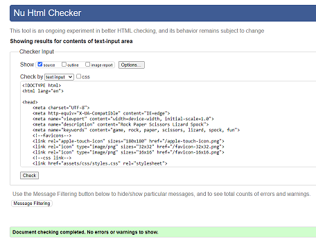
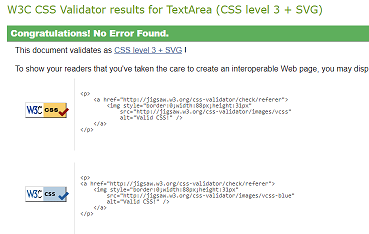
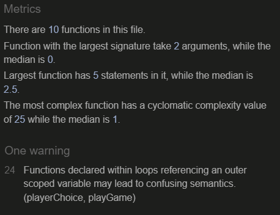
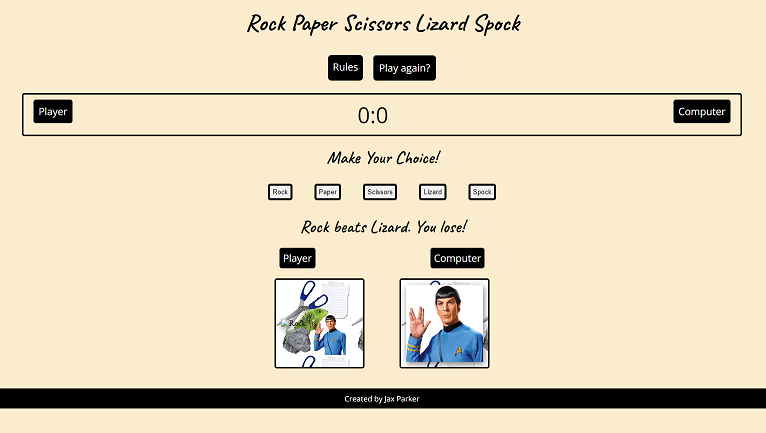
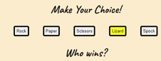
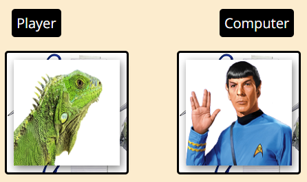
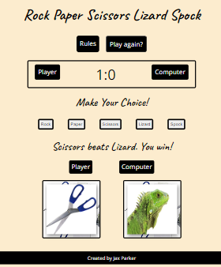
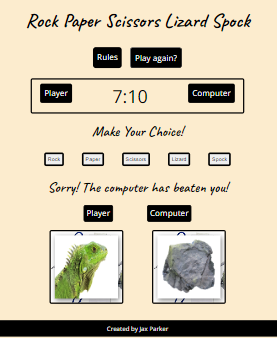

# TESTING

## Manual testing

### Features

Feature Tested | Expected Result | Actual Result | Pass/Fail
---------------|-----------------|--------------|--------------
Diplay game all elements present | Show game elements on page| As expected | Pass
Page responsivness | Use Google Toggle to test respoinsiveness | As expected | Pass
Hover colour change on buttons | Player hovers mouse over each button, pointer changes to hand and colour changes| As expected | Pass
Rules button | On click opens rules page all elements present | As expected | Pass
Play Game button | On rules page, takes you back to game page | As expected | Pass
Choice buttons | Button choice corresponds to image and text | As expected | Pass
Computer Choice | Random image appears once player has made their choice| As expected | Pass
Message div | Shows correct message corresponding to images | As expected | Pass
Scoreboard | Score increments by one depending on player or computer win | As expected | Pass 
Scoreboard Tie | Score does not increment by one | As expected | Pass
Play again? button | Game resets and scores return to zero at any time when clicked | As expected | Pass
End Of Game | When computer or player score reaches 10, winner message appears | As expected | Pass
End Of Game | When computer or player score reaches 10 game resets images & score | As expected | Pass
404.html | Page created and tested on github & live versions of the site | Does not work on live verson | Pass/Fail

## Bugs

Bug | Status | Fix  
----|--------|-----
Game allowed user to keep incrementing scores after 10| Resolved | Student Support explained that my play again button was included in my button loop so wasn't working - I changed it to a span and the 'button' then worked.
Game showed comp image and alt image on play again button| Resolved | Again with Studen Support help, the issue above resolved this issue too.

## Remaining Bugs

  * 404 page does not work on live site yet.

## Validator Testing

* HTML - tested through the [W3C HTML Validator](https://validator.w3.org/) and no errors were found. 
 
 * CSS - tested through the [W3C CSS Validator](https://jigsaw.w3.org/css-validator/) and no errors were found. 
 
 * JavaScript - tested through the [Jshint.com](https://jshint.com) and no errors were found. 
  one warning was shown as explained in the Portfolio Project Scope video.

## Testing User Stories

* As a visiting user, I want to be able to understand how to play the game after reading the rules.
    * The user can see all the buttons, messages and images on the page. 
   
   

* As a visiting user, I want to be able visually see which choice I made & which choice the computer made.
    * The user can clearly see which button they are targeting as, on hover, it changes colour and the pointer turns into a hand. 
    * The user can see the image of the choice they made and the random choice of the computer. 

   
   

* * As a visiting user, I want to be able to see who won the point and see the scores.
    * User sees message & images explaining who one the point and score is incremented accordingly. 

    

* As a visiting user, I want to be able to be able to replay after the game has finished.
    * When the score of either player reaches 10, a message to the player to say who one is shown and the screen reset.  
    
    